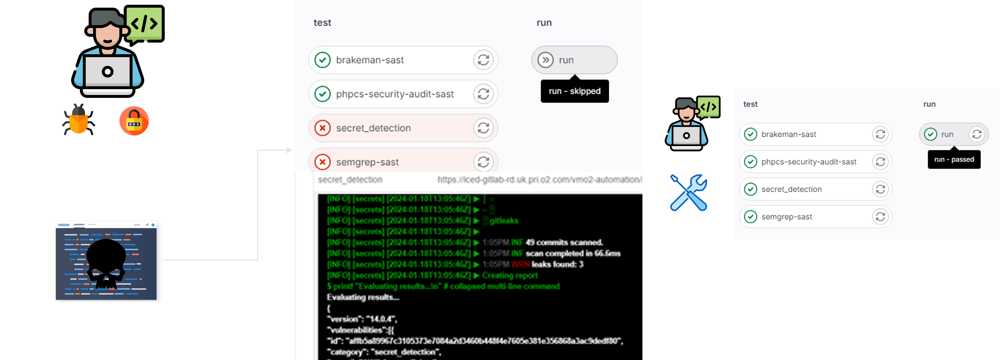

# Never Ever Run Unsafe Code



---

Never Ever Run Unsafe Code (NERUC) integrates GitLab security scanning tools to ensure **vulnerable code** and **secrets** are never executed or deployed into any environment. By setting up a series of **security scan jobs** and **customized checks** in the CI/CD pipeline, it effectively prevents unsafe code from ever being executed even in the development phase. The diagram above illustrates how this process works.

- **Key objective**: Prevent deployment of insecure code that contains vulnerabilities or secrets.
- **Tools used**: GitLab SAST (Static Application Security Testing), secret detection, Semgrep, Brakeman, and more.
- **Customization**: Additional rules and scripts have been written to fail the pipeline when high-severity vulnerabilities or secrets are detected.

## Project Setup

### Online Setup

1. **Duplicate Security Jobs**  
   This project duplicates all GitLab's built-in security scan jobs and adds custom evaluation rules to stop the pipeline if any critical vulnerabilities are found.
   
   You can find more information on GitLab's security scanning features here: [GitLab SAST Documentation](https://docs.gitlab.com/ee/user/application_security/sast/)  
   
   To add these checks, I've included the following templates in the `.gitlab-ci.yml` file:
   
   ```yaml
   include:
     - template: Security/SAST-IaC.gitlab-ci.yml
     - template: Security/SAST.gitlab-ci.yml
     - template: Security/Secret-Detection.gitlab-ci.yml
   ```
   Customize the scan jobs with additional evaluation steps that stop the jobs in the next stage when a vulnerability is found, such as:
   ```yaml
   .evaluate_vulnerabilities: &evaluate_vulnerabilities
    - |
      printf "Evaluating results...\n"
      if grep -q '"vulnerabilities":\[\]' gl-sast-report.json; then
        echo "No vulnerabilities found :)"
      else
        echo "Vulnerabilities detected, failing the pipeline."
        exit 1
      fi
   ```
2. **Custom Rules**  
You can customize when certain scan jobs should run. For instance, in this project, I limit scanning to the main branch(because the code is already safe!):

```yaml
rules:
  - if: $CI_COMMIT_REF_NAME != "main"
    when: never
```

### Offline Setup
If you run an offline GitLab instance or the runner doesn't have access to the internet, you can pull the security scanning images, store them in an internal container registry, and reference them in the pipeline. Please make sure that you keep updating your images.
Refer to the official GitLab documentation on offline deployments for more details: [GitLab Security Scans Offline Deployment](https://docs.gitlab.com/ee/user/application_security/offline_deployments/)

You will need to update the security scanning job with the appropriate image path:

```yaml
kubesec-sast:
  image:
    name: "registry.internal/my-sast-analyzers/kubesec-sast:latest"
  script:
    - /analyzer run
```

## How to Use

### Including from a Local File
You can include a pre-configured security template from your local repository into `.gitlab-ci.yml`:
```yaml
include:
  - local: 'security/.security_scanning.yml'
```


### Including from a Remote Repository
Alternatively, include security scans from a remote GitLab repository:

```yaml
include:
  - project: 'group/repo'
    file: 'security/.security_scanning.yml'
```
Make sure the remote repository has access to your project or has public visibility to work correctly.

## Pipeline Stages
- **SAST Scans:** Detect static vulnerabilities in the source code using tools like Semgrep, Brakeman, and more.
- **Secret Detection:** Identify any secrets (e.g., API keys, tokens) accidentally committed into the codebase.
- **Custom Evaluations:** Fail the pipeline if any critical vulnerabilities are detected

---
If you are interested in collaborating or learning more, please reach out to me (<darshannij@gmil.com>)
   
